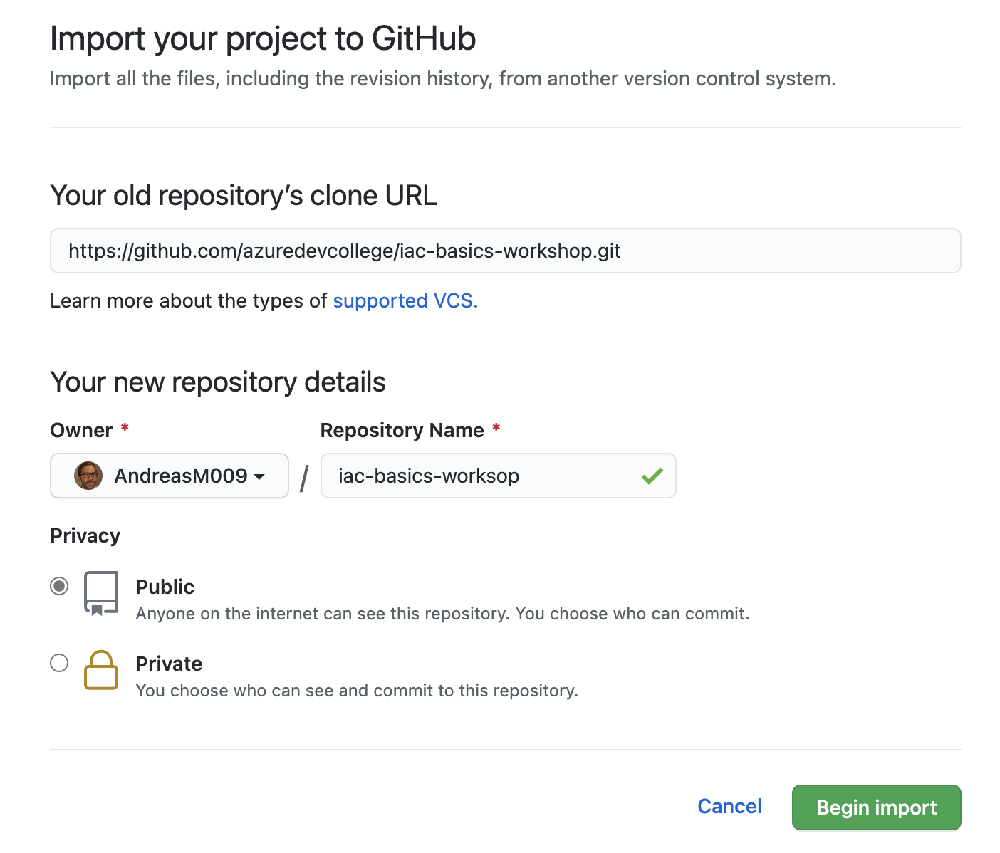

# Challenge_01 Import the workshop repository into your personal GitHub organization

To be able to follow all the challenges in this workshop we need to import the workshop's repository into your personal GitHub organisation and clone the newly imported repository to your local machine.

## Import the repository

Navigate to your personal GitHub organisation and click the **repositories** tab view.
There is a green button **new** displayed, click it to create a new repository. In the new view there is a small link **Import a repository**. Click it to import the workshop's repository.

Set `https://github.com/azuredevcollege/iac-basics-workshop.git` as value for **Your old repository's clone URL** and set `iac-basics-workshop` for the name of the new repository.



Click **Begin import** to start the import process.

## Clone the new repository to your local machine

Now that the repository has been imported into your personal GitHub organisation, navigate to the repository.

> :warning: Please make sure that you navigate to the rigtht repository in your personal GitHub Account!
> The URL should look something like this: `https://github.com/<your org>/iac-basics-workshop`

Click the green code button and copy the URL.
Open a shell, create a new folder and clone the repository using git and the clone command.

```Shell
>mkdir azuredevcollege
>cd azuredevcollege
>git clone https://github.com/<your org>/iac-basics-workshop
```

Now the repository is available on your local machine and we can move on to the next challenge where you will learn some git basics.