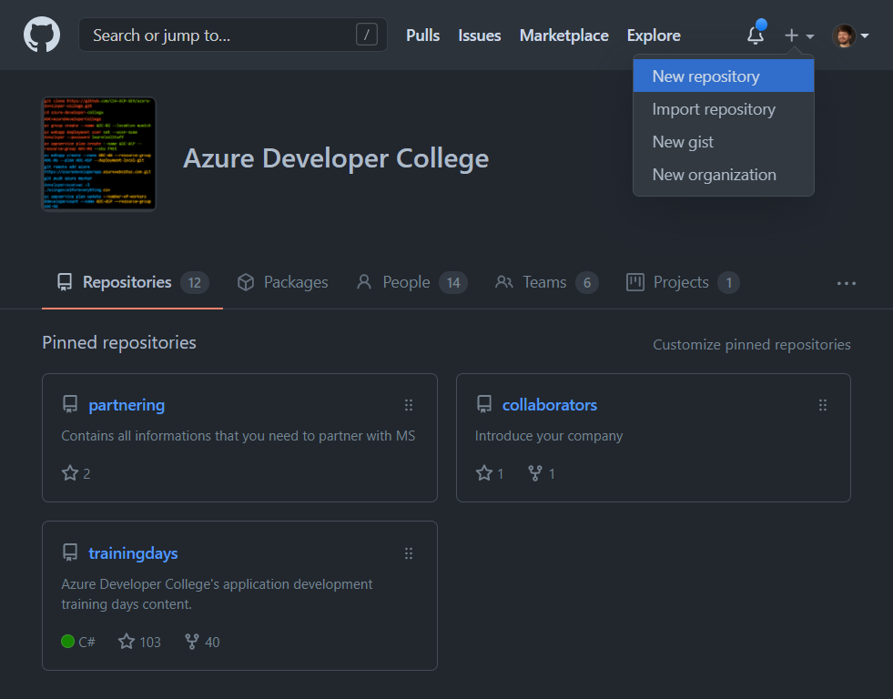
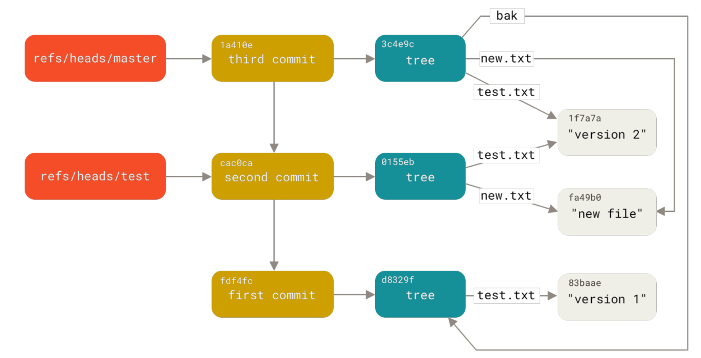

# Git Basics

In this section we will provide you a brief introduction to git as well as
some materials for self study.

::: tip
If you already have some experience using git you can jump immediately to
[resources section](#helpful-resources) and start the _Learn Git Branching_
exercise.
:::

## The basics

You are using git for the first time or coming back to it? **Start here!**

### Settings for first timers

Git writes commit with your name and email address as metadata. Before you
start doing anything with it let's setup the basics.

```shell
git config --global user.name "Alex Sample"
git config --global user.email "alex@sample.com"
git config --global core.editor "code --wait"
git config --list
```

Setting the `core.editor` tells git to use VSCode as your preferred editor
for commit messages. Set this if you do not know vim or configure to your own
preference.

The `--list` command shows you all currently active settings. They take into
account your current projects settings, your _global_ user settings and your
_system_ settings.

### Creating the first repository

Now we are ready to go. Fire up a command line window and create a new
folder. Then run the `git init` command inside that folder to enable the git
version control for it.

```shell
$ mkdir getting-started && cd getting-started
$ git init
Initialized empty Git repository in /home/<username>/getting-started/.git/
$ git status
On branch master

No commits yet

nothing to commit (create/copy files and use "git add" to track)
```

The `git status` tells you what the current state of you git repository is.
If there are current changes or even if you are in the middle of a
complicated `merge` or `rebase` operation.

When in doubt run `git status`. It also gives you some instructions on
what your next steps might be.

Let's create a new file and see if `git` notices the difference:

```shell
$ touch README.md
$ git status
On branch master

No commits yet

Untracked files:
  (use "git add <file>..." to include in what will be committed)
        README.md

nothing added to commit but untracked files present (use "git add" to track)

```

As you can see, `git` now noticed that there is a new untracked file inside
you folder and suggests you to use the `git add` command to add it the
tracking.

Let's follow the that recommendation.

```shell
$ git add .
$ git status
On branch master

No commits yet

Changes to be committed:
  (use "git rm --cached <file>..." to unstage)
        new file:   README.md

```

::: tip

The **.** in `git add .` tells _git_ to track everything inside the current
folder.

:::

Now _git_ sees the new file and lists it under the _Changes to be committed_
section.

Let's go ahead an create our first commit.

```shell
$ git commit -m "Create empty README.md"
[master (root-commit) 9c158cf] Create empty README.md
 1 file changed, 0 insertions(+), 0 deletions(-)
 create mode 100644 README.md

```

::: tip

If you omit the `-m "Create empty README.md"` from the above command, git
will open your editor to enter the commit message. The `commit` command will
wait for you to save and close the editor window.

:::

The _de facto standard_ is to have a `README.md` markdown file on the root
folder of your project to provide basic information and setup instruction for
your project.

```markdown
# Getting started with git

It's easy if you take one step at a time.
```

```shell
$ git status
On branch master
Changes not staged for commit:
  (use "git add <file>..." to update what will be committed)
  (use "git restore <file>..." to discard changes in working directory)
        modified:   README.md

no changes added to commit (use "git add" and/or "git commit -a")

$ git commit -a -m "Add a heading and some text"
[master 2985691] Add a heading and some text
 1 file changed, 3 insertions(+)
```

Let's extend our current `README.md`.

```markdown
# Getting started with git

Git might look intimidating to begin with...

## How hard is it?

It's easy if you take one step at a time.
```

Also let's add a `.gitignore` file to ignore files that we don't want to track.

```gitignore
*.bak
*~
```

::: tip

Always use a `.gitignore` file in you projects. Since git tracks every file
in the workspace by default you will almost always have files you want to _ignore_.

- `node_modules/` module dependencies that take a lot of space and can be
  installed using lifecycle management

- `tmp` any kind of temporary files and build outputs

- `.vscode/` sometimes exclude editor-files and personal configuration

- `.secrets.env` exclude files that may contain secrets

:::

Let's check the outputs of `git status` and inspect the changes to the files in
more detail.

```shell
$ git status
On branch master
Changes not staged for commit:
  (use "git add <file>..." to update what will be committed)
  (use "git restore <file>..." to discard changes in working directory)
        modified:   README.md

Untracked files:
  (use "git add <file>..." to include in what will be committed)
        .gitignore

no changes added to commit (use "git add" and/or "git commit -a")

```

As you can see _git_ noticed that we have changed the `README.md` and have a
new file named `.gitignore` in our current working directory.

Let's check in detail what changes it detects on the `README.md`.

```shell
git diff
```

You should see some output like this:

```git
diff --git a/README.md b/README.md
index cebce42..456c986 100644
--- a/README.md
+++ b/README.md
@@ -1,3 +1,7 @@
 # Getting started with git

+Git might look intimidating to begin with...
+
+## How hard is it?
+
 It's easy if you take one step at a time.
(END)
```

:::tip
You can close the diff viewer by pressing `Q`.
:::

Note that git _inserted_ the new lines between the first ones and remember
the initial lines stay the same.

The `.gitignore` files is not shown here. Changes to it are not tracked yet.

```shell
$ git commit -am "Add more content to README and ignore temporary files"
[master 0a92cb8] Add more content to README and ignore temporary files
 1 file changed, 4 insertions(+)
```

Now you have created your first commits let's see how we can share them with
your colleagues.

First create a new repository on GitHub:



Then you can follow the instructions for connecting your local repository.

## Helpful resources

If you feel underwhelmed with the content of this intro, check out [Learn Git
Branching](https://learngitbranching.js.org/) and see if you can master the
later _levels_ of the tutorial. You should already know you way around git to
get the most out of it.

- [Introduction to version control in Git (~3
  hours)](https://docs.microsoft.com/en-us/learn/paths/intro-to-vc-git/) Our
  first exercise here covers about the first hour of the course.

- [Learn Git Branching](https://learngitbranching.js.org/) _a visual and
  interactive tutorial._ Once you have the basics, play through all the levels
  and try not to exceed the number of commands for each exercise.

- [Pro Git](https://git-scm.com/book/en/v2) _by Scott Chacon and Ben Straub_

- [gitignore.io](https://www.toptal.com/developers/gitignore) _generate
  `.gitignore` files for your projects._ Use this for new projects or when
  creating a git repository out of existing ones.

- [Mastering
  Markdown](https://guides.github.com/features/mastering-markdown/) a quick
  intro to GitHub Flavoured Markdown

- [GitHub Flavored Markdown](https://github.github.com/gfm/) the complete
  specification.

- [Git Cheat Sheets](https://training.github.com/) _Reference sheets in
  different languages._

## How to create a sample tree

This is an optional task to create a sample object graph in git and later
exploring it using the `git cat-file` command.

```shell
$ mkdir git-basics
$ cd git-basics
$ git init
Initialized empty Git repository in /home/<username>/git-basics/.git/

$ echo "version 1" > test.txt
$ git add test.txt
$ git commit -m "first commit"
[master (root-commit) fdf4fc] first commit
 1 file changed, 1 insertion(+)
 create mode 100644 test.txt

$ echo "new file" > new.txt
$ echo "version 2" > test.txt
$ git add new.txt test.txt
$ git commit -m "second commit"
[master cac0ca] second commit
 Date: Thu Apr 8 11:50:56 2021 +0200
 2 files changed, 2 insertions(+), 1 deletion(-)
 create mode 100644 new.txt
$ git branch test

$ mkdir bak
$ echo "version 1" > bak/test.txt
$ git commit -m "third commit"
[master 1a410e] third commit
 1 file changed, 1 insertion(+)
 create mode 100644 bak/test.txt
```



Now you can start browsing the tree structure like this:

```shell
$ git cat-file -p master
tree 3c4e9cd789d88d8d89c1073707c3585e41b0e614
parent 324177edbf6d0ae3f12d657302f2627d6347c2c6
author Clemens Wältken <clemens.waltken@microsoft.com> 1617876347 +0200
committer Clemens Wältken <clemens.waltken@microsoft.com> 1617876347 +0200

third commit
$ git cat-file -p 3c4e9c
...
```
