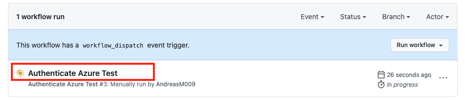

# Challenge_04 Create a GitHub Workflow to deploy an ARM Template

In this challenge, we create a GitHub workflow to deploy the ARM template we
created in the previous challenge. A GitHub Workflow is an automated pipeline
to build and deploy artifacts like an Azure ARM Template. A workflow is like
an orchestration of multiple jobs and steps to build and deploy artifacts. It
is is kicked off by a trigger. A GitHub Workflow supports different trigger
types, but in this challenge we trigger the workflow manually.

[Here](https://docs.github.com/en/actions/reference/events-that-trigger-workflows) you can find a description of all supported trigger types.
The [workflow_dispatch](https://docs.github.com/en/actions/reference/events-that-trigger-workflows#workflow_dispatch) trigger allows us to trigger a workflow manually.

## Grant a GitHub Workflow access to your Azure Subscription

To grant a GitHub workflow access to your Azure subscription, we need to
create an Azure AD service principal and assign it the desired rights to the
subscription. After creating the service principal and assigning the
permissions, we need to pass the service principal to GitHub so the workflow
can access it. GitHub provides a secret store, to save sensitive information
in your organization, repository or repository environment. When a workflow
is executed these secrets are injected as encrypted environment variables and
accessible in the workflow definition.

To create a service principal and assign the needed rights we use the Azure
CLI and the **ad sp create-for-rbac** command. Open a shell and replace the
needed values marked with <>:

```Shell
az ad sp create-for-rbac --name "<sp name>" --role contributor --scopes /subscriptions/<subscription id> --sdk-auth
```

::: tip

If you don't know your subscription id use the **account show** command:

```shell
az account show
```

:::

Copy the JSON output object for your service principal:

```JSON
{
  "clientId": "<GUID>",
  "clientSecret": "<GUID>",
  "subscriptionId": "<GUID>",
  "tenantId": "<GUID>",
  (...)
}
```

Open your GitHub repository 'iac-basics-workshop' an go to **Settings**.


Select Secrets and then **New repository secrets**.


Paste in your JSON object for your service principal with the name
AZURE_CREDENTIALS.


## Create a Workflow that logs on to Azure

Now we create our first workflow to check if the workflow can authenticate.
Workflows are stored in **.github/workflows** of your repository's root
directory.

Create a workflow file under **.github/workflows** and name it
**authenticate-test.yml**.

### Options for triggering a workflow

There are several options for triggering a workflow. To get a full list of
all available trigger have a look at [Events that trigger
workflows](https://docs.github.com/en/actions/reference/events-that-trigger-workflows)
at GitHub documentation.

We use the **worklow_dispatch** trigger in our example to be able to trigger
a workflow manually. To use this trigger your workflow trigger will look like
this:

```yaml
name: Authenticate Azure Test
on:
  workflow_dispatch:
```

### GitHub Actions

The [GitHub
Marketplace](https://github.com/marketplace?type=actions&query=azure) has
several actions that help you automate Azure related tasks. As we want to
login to Azure we use the [azure/login@v1](https://github.com/Azure/login)
GitHub Action and pass the **AZURE_CREDENTIALS** secret to authenticate using
the previous created service principal:

```yaml
jobs:
  login-azure:
    steps:
      - name: "Login via Azure CLI"
        uses: azure/login@v1
        with:
          creds: ${{ secrets.AZURE_CREDENTIALS }}
```

To see if the workflow is authenticated and uses the right subscription, we
can run command-line programs using the operating systems shell:

```yaml
steps:
---
- name: Show Azure Account
  run: az account show
```

### Add the workflow file to your remote repository

Your workflow file **.github/workflows/authenticate-test.yml** should now
look like this:

```yaml
name: Authenticate Azure Test

on:
  workflow_dispatch:

jobs:
  login-azure:
    runs-on: ubuntu-latest
    steps:
      - name: 'Login via Azure CLI'
        uses: azure/login@v1
        with:
          creds: ${{ secrets.AZURE_CREDENTIALS }}
      - name: Show Azure Account
        run: az account show
```

Save the file, add, commit and push the changes:

```Shell
git add .
git commit -m "added auth test workflow "
git push
```

### Run the workflow

Now open a browser and navigate to your GitHub **iac-basics-workshop**
repository, go to Actions and you will see your created workflow
**Authenticate Azure Test**.


Now run the workflow. First click on the workflow **Authenticate Azure Test**
then click **Run workflow** and select the main branch. Confirm your branch
selection by clicking the green **Run workflow** button:


Now click on the running workflow to see more details. Navigate through the
interface and see all the information about the run.



## Add a Step to deploy an Azure ARM Template

Now that we have seen how to authenticate a workflow against Azure it's time
to deploy an ARM template. First clone the existing workflow
**authenticate-test.yml** and rename the clone to **storage-arm.yml**. We
will deploy the ARM template we created in [Challenge_03](./challenge_03.md)
to Azure. There is already a GitHub Action available in the [GitHub
Marketplace](https://github.com/marketplace/actions/deploy-azure-resource-manager-arm-template)
to deploy an Azure ARM Template.

The workflow needs some parameters, which we define as environment variables:

```yaml
env:
  ResourceGroupName: '<your RG name>'
  ResourceGroupLocation: 'westeurope'
  StorageAccountName: '<your StorageAccount name>'
```

In order to access the Azure ARM Template we need to checkout the repository,
so the workflow can access it.
[Here](https://github.com/marketplace/actions/checkout) you can find a
details description of the **checkout** action in the GitHub Marketplace.

```yaml
- uses: actions/checkout@v2
```

To ensure that the ResourceGroup to which the ARM template is applied exists,
we simply use the [Azure
CLI](https://github.com/marketplace/actions/azure-cli-action) action:

```yaml
- uses: Azure/CLI@v1
    with:
      inlineScript: |
        #!/bin/bash
        if $(az group exists --name ${{ env.ResourceGroupName }}) ; then
          echo "Azure resource group already exists, skipping creation..."
        else
          az group create --name ${{ env.ResourceGroupName }} --location ${{ env.ResourceGroupLocation }}
          echo "Azure resource group created"
        fi
```

At end we can use the [Deploy Azure Resource Manager (ARM)
Template](https://github.com/marketplace/actions/deploy-azure-resource-manager-arm-template)
action to deploy the ARM template:

```yaml
- uses: azure/arm-deploy@v1
  with:
    resourceGroupName: ${{ env.ResourceGroupName }}
    template: './challenges/templates/challenge_03/storage.json'
    parameters: storageAccountName=${{ env.StorageAccountName }}
```

Your workflow should look like this:

```yaml
name: Storage ARM Template

on:
  workflow_dispatch:

jobs:
  deploy-storage:
    runs-on: ubuntu-latest

    env:
      ResourceGroupName: '<your RG name>'
      ResourceGroupLocation: '<your Azure location to use>'
      StorageAccountName: '<your StorageAccount name>'

    steps:
      - name: 'Login via Azure CLI'
        uses: azure/login@v1
        with:
          creds: ${{ secrets.AZURE_CREDENTIALS }}
      - uses: actions/checkout@v2
      - uses: Azure/CLI@v1
        with:
          inlineScript: |
            #!/bin/bash
            if $(az group exists --name ${{ env.ResourceGroupName }}) ; then
              echo "Azure resource group already exists, skipping creation..."
            else
              az group create --name ${{ env.ResourceGroupName }} --location ${{ env.ResourceGroupLocation }}
              echo "Azure resource group created"
            fi
      - uses: azure/arm-deploy@v1
        with:
          resourceGroupName: ${{ env.ResourceGroupName }}
          template: './challenges/templates/challenge_03/storage.json'
          parameters: storageAccountName=${{ env.StorageAccountName }}
```

::: tip

Please replace all values between **'<>'** with your values!!

:::

Now we can add, commit and push the changes:

```shell
git add .
git commit -m "Storage workflow"
git push
```

Navigate to the Action section in your GitHub repository and run the
workflow. Check if the StorageAccount was created in your subscription.

## Congratulations

You have created your first GitHub workflow, used a service principal to
login to Azure and deployed an ARM Template.
