# Challenge_05 Create a Pull Request validation workflow

In this challenge we will create a GitHub workflow that is used to validate a Pull Request.
If you work on a new feature or if you make changes to your production system, a best practice is to create a branch from your main branch and do all the work in the newly created branch before changes are merged back to the main branch. This strategy keeps your main branch clean and build breaks can be avoided. When you have finished your work you create a Pull Request to collaborate with other team members to review and discuss about the changes.

## The scenario

Let's say we want to roll out an Azure Storage account in a Resource Group using an ARM template. In order to ensure that we do not destroy anything in the production system, it would make sense to get feedback within the pull request which changes the ARM template would cause. Of course, we do not want to run this test against the production system. But since we have mapped the current state of the production system in the main branch, we can use the sources from the main branch to build a temporary environment. Once the temporary environment is created, we can run the test against that environment. To test the effect of an ARM template we use an ARM template deployment with the what-if option. 

```shell
CHANGES=az deployment group what-if -n demo01 -g rg-name --template-file path/to/template --parameters param01=value01
```

For better collaboration, it makes sense to map this procedure in a GitHub workflow and visualize the result of the what-if deployment directly in the pull request. This allows the team to discuss the possible changes.

The GitHub Script action allows us to access GitHub resources like an issue and add a comment. You can find the documentation [here](https://github.com/actions/github-script) on GitHub. 

``` yaml
- uses: actions/github-script@v3
  with: 
    github-token: ${{ github.token }}
    script: |
      github.issues.createComment({
        issue_number: ${{ github.event.number }},
        owner: context.repo.owner,
        repo: context.repo.repo,
        body: `your comment`
        })

```

### The flow to validate an ARM template with a what-if deployment within a Pull Request

The following diagram illustrates the what-if deployment process:

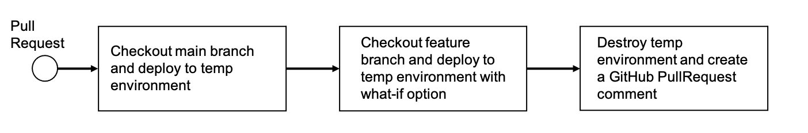


### Deploy to a staging environment

At this point we can prepare an environment from the main branch and rollout our ARM template with the what-if option to see how the template would affect the environment. 
This is a great way to already check what would happen. But this is not enough, because we also want to know how an environment looks like when we deploy the ARM template. That's why we extend our workflow to build a staging environment. This environment can then be tested, validated and it is a copy of the production system with the changes that the ARM template brings. 
Again, the environment is first built from the main branch and then the ARM template is deployed from the branch. The GitHub script action is used to add a comment to the pull request describing the necessary information of the staging environment (e.g. name of the ResourceGroup).

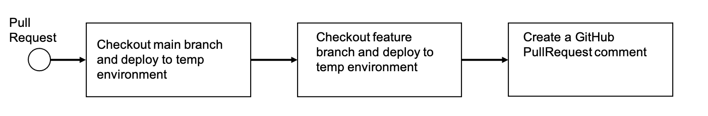

After the environment is provided we can take all measures to ensure the quality.


### Destroy the staging environment

If the staging environment meets our quality requirements, we can delete this environment again and take over the pull request. 
Destroying the staging environment is easy. We just need to delete the ResourceGroup with a simple Azure CLI command:

```shell
az group delete -n rg-name -y
```

### Unique names for temporary environments

When we create the name for our temporary environments, we need to make sure they are unique. Also, it would be useful to somehow associate the name with the name of the branch to which the pull request belongs. There is a GitHub action available which exposes short values of some GitHub environment variables inside a GitHub workflow. 
The documentation of the GitHub Slug action can be found [here](https://github.com/rlespinasse/github-slug-action).
The action injects the __GITHUB_HEAD_REF_SLUG_URL__ environment variable. Git has a special reference, __HEAD__. This is a symbolic reference which points to the tip of the current branch, rather than an actual commit. If we have a branch called __my-branch__ the reference would look like this: __refs/head/my-branch__.
The environment variable __GITHUB_HEAD_REF_SLUG_URL__ contains a short value for __HEAD__, which is at the end the name of the branch __my-branch__. We can use this value as the name for the ResourceGroup, since this name is unique within our repository.
The following yaml snippet shows how to use the GitHub Slug action and how to assign the __GITHUB_HEAD_REF_SLUG_URL__ environment variable to an environment variable __ResourceGroupName__:

```yaml
env:
  ResourceGroupName: ""
  ResourceGroupLocation: "westeurope"
  StorageAccountPrefix: "sta"

jobs:
  deploy-from-main:
    runs-on: ubuntu-latest

    steps:
      - name: Inject slug/short variables
        uses: rlespinasse/github-slug-action@v3.x

      - name: Set ResourceGroupName from slug/short
        run: echo "ResourceGroupName=${{ env.GITHUB_HEAD_REF_SLUG_URL }}-rg" >> $GITHUB_ENV
```

Of course, we also need to make sure that all Azure resources that need a unique name get one. If we look at the ARM template, we see that a prefix parameter must be passed. With this prefix and the unique ID of the resource group a unique name for the storage account is created:

```JSON
{
  "parameters": {
    "storageAccountPrefix": {
      "type": "string",
      "metadata": {
        "description": "prefix to use for the storage account's name"
      }
    }
  },
  "variables": {
    "storageAccountName": "[concat(parameters('storageAccountPrefix'), take(uniqueString(resourceGroup().id), 4))]"
  }
}
```

The ARM template can be found under the repository's root [/challenges/templates/challenge_05/storage.json](./templates/challenge_05/storage.json).


### Apply labels to your Pull Request to control the workflow

We now have the basis to either run a validation or build a staging environment and delete it again.
But how do we control whether a validation or the creation of a staging environment should be triggered? 
The answer is GitHub labels. 

A workflow needs a trigger to be executed. As we want the workflow to be triggered only  within a Pull Request and if a label is applied, we use the Pull Request trigger and the type __labeled__ as follow:

```yaml
name: PullRequest Validation

on:
  pull_request:
    types: [labeled]
```

By specifying this, the workflow will only be started if a pull request has been created and a label is applied.
Next, it is necessary to check within the definition which label has been set. Let's assume we have the following labels:

- __validate__: runs the what-if deployment
- __stage__: deploys the changes to a staging environment
- __destroy__: destroys the staging environment

Now we can check and decide which steps should be executed within the workflow based on the value of the label.

```yaml
jobs:
  deploy-from--main:
    runs-on: ubuntu-latest

    if: |
      (contains(github.event.pull_request.labels.*.name, 'validate') ||
      contains(github.event.pull_request.labels.*.name, 'stage')) &&
      !contains(github.event.pull_request.labels.*.name, 'destroy')
    steps:
    ...

  what-if-deployment:
    runs-on: ubuntu-latest
    needs: deploy-from--main

    if: |
      contains(github.event.pull_request.labels.*.name, 'validate') &&
      !contains(github.event.pull_request.labels.*.name, 'stage') &&
      !contains(github.event.pull_request.labels.*.name, 'destroy')
    steps:
    ...

  stage-deployment:
    runs-on: ubuntu-latest
    needs: deploy-from--main

    if: |
      contains(github.event.pull_request.labels.*.name, 'stage') &&
      !contains(github.event.pull_request.labels.*.name, 'destroy')

    steps:
    ...

  destroy-stage-deployment:
    runs-on: ubuntu-latest

    if: contains(github.event.pull_request.labels.*.name, 'destroy')
    steps:
    ...
```

### Inspect the workflow definition

Don't worry, we don't want you to implement the workflow yourself now. The workflow is already there. Please take your time and have a close look at the definition before we see the workflow in action.
The workflow definition can be found in the repository's root directory under [.github/workflows/pr-validation.yml](../.github/workflows/pr-validation.yml).


## See the workflow in action

Now it's time to see the workflow for the described scenario in action. 
First we need to create a new branch and make some changes to the code.

Open a shell, navigate to the iac-basics-workshop folder, create a branch and check it out:

```shell
git branch prvalidation
git checkout prvalidation
```

Rename the file [/challenges/templates/challenge_05/storage.json__rename_me](./templates/challenge_05/storage.json__rename_me) to __storage.json__.

Add and commit the changes:

```shell
git add .
git commit -m "see the workflow in action"
```

Next, push the branch to the remote repository:

```shell
git push --set-upstream origin prvalidation
```

Now the branch is available in your remote repository. Open a browser, navigate to your iac-basics-workshop repository and click the __Pull Request__ tab.
You will see that GitHub informs you that your branch __prvalidation__ had recent pushes and thta the branch is ready to integrate by creating a Pull Request:

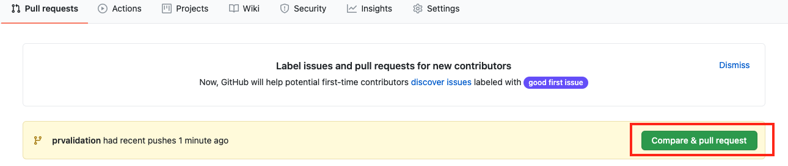

Click __Compare & pull request__ to open a Pull Request for your changes. If you like, you can leave a title and a comment for your pull request.
Take the time to see what information is already provided within the pull request.

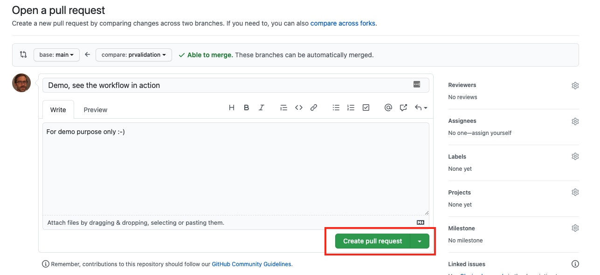

Click __Create pull request__ to create your Pull Request.

After the Pull Request is created, we can trigger a what-if deployment. To trigger the deployment we need to apply the label __validate__ to our Pull Request. In your open Pull Request, you can add a label in the right-hand side bar under __Labels__:

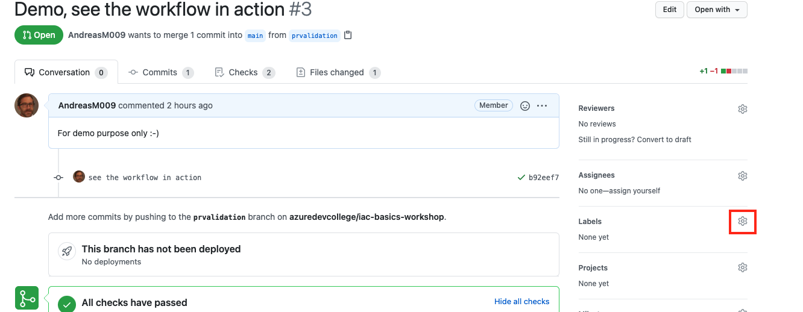

Add the label validate. If you use the label validate for the first time, you have to create it:

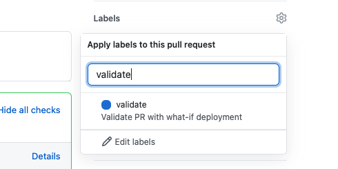

After the label is applied it takes a few seconds until the workflow is triggered. Click on __Details__ to see more information:

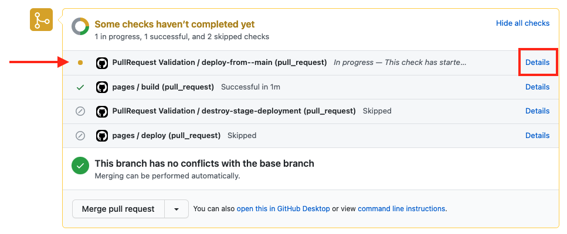

When the what-if deployment has run, we see the result in the pull request, which is stored as a comment. Based on this comment, we can discuss the possible changes in the team:

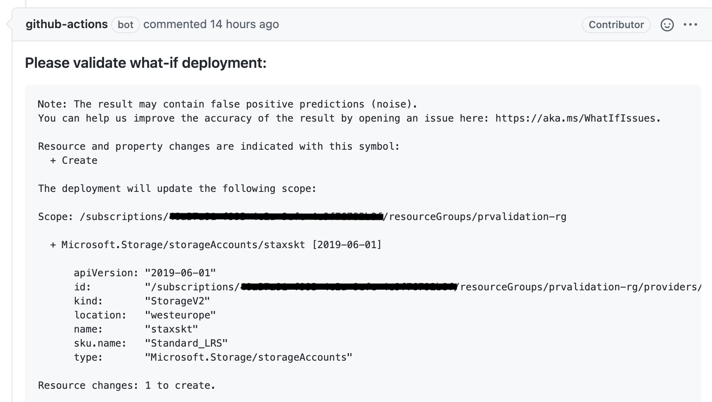

As a next step, we can add the label stage to deploy the changes in a temporary staging environment. We can use this environment to check the changes live:

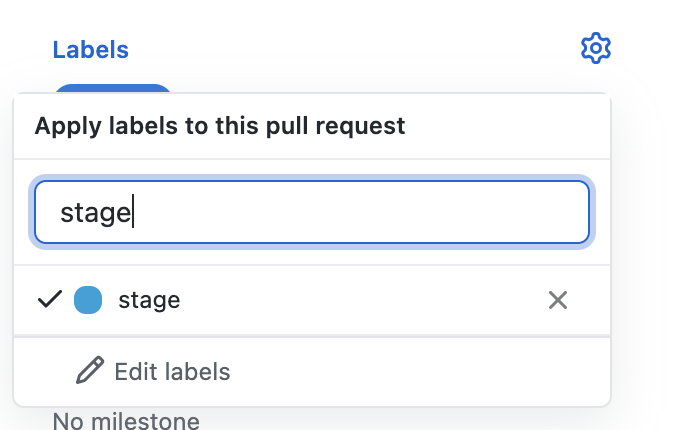

After the label is applied it takes a few seconds until the workflow is triggered. Click on __Details__ to see more information:

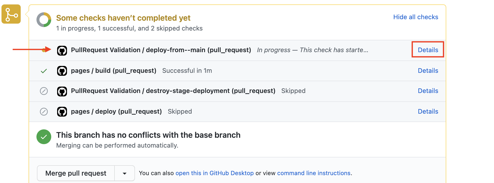

When the stage deployment has run, we see the result in the pull request, which is stored as a comment. The comment contains the name of the Resource Group where the staging environment is deployed:

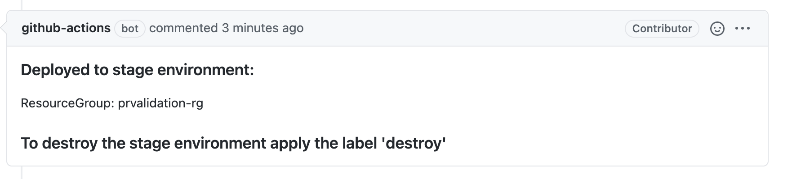

Navigate to your Azure subscription in the Azure portal and check if the resource group is there.

As mentioned in the comment, we can delete the staging environment when we add the label destroy. Again, it takes a few seconds until the workflow is started:

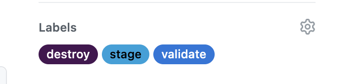


## Congratulations

You have seen how you can use a pull request and a GitHub workflow in an advanced scenario.


